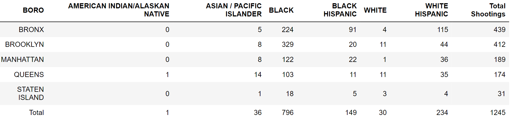

## Data-Analyst-Portfolio

## Education & Certifications
- Data Analytics Apprentice | COOP Careers (_Feb 2024_) 
- B.A. Computer Science | Hunter College (_May 2023_)

## Work Experience
**Data Science Intern @ NYC Department of Transportation (_Aug 2022 - Dec 2022_)**
- Designed and implemented a YOLOv5-based pavement marking detection model using a dataset of 500+ images, enabling
city maintenance crews to precisely gauge the quantity and condition of markings in key areas
- Visualized and presented model performance metrics using Python’s Matplotlib to simplify complex data for non-technical
supervisors, ensuring informed decision making
- Input and managed under deck lighting data using Cyclomedia GIS, ensuring accurate identification of areas in need of
maintenance, improving lighting across 700+ bridges and tunnels

**IT Intern @ NYC Department of Education (_Feb 2022 - June 2022_)**
- Designed and implemented an inventory system using Microsoft Excel for hundreds of devices such as laptops and printers
for students and staff streamlining school device management
- Collaborated effectively with a team to maintain daily functionality, addressing software and hardware challenges and
logging repair tickets for over 600+ students and faculty
- Managed IT administrative tasks, efficiently handling email communications and coordinating meetings, enhancing team
collaboration and workflow efficiency

## Recent Projects
**Summer Olympics EDA**

- Utilized SQL and Tableau for an in-depth analysis of Olympic data, crafting visualizations that uncover significant trends
and patterns in over 120 years of performance metrics such as country medal count  
Explore the [Tableau Dashboard](https://public.tableau.com/views/TheSummerOlympicsTheDataBehindTheGlobalStageofOurGreatestAthletes/Dashboard2?:language=en-US&:display_count=n&:origin=viz_share_link) & [Github Repo](https://github.com/jdl456/Summer-Olympics-EDA)

**NBA Win Predictor**
- Analyzed extensive NBA game data using Python Pandas to extract vital team statistics, and built a logistic regression
model for win prediction on future NBA games, achieving 68% prediction accuracy on a test set of 2,148 games   
Explore the [Github Repo](https://github.com/jdl456/Nba-win-predictor)

**Map Visualization of 2023 NYC Shootings**
- This interactive map vividly showcases the distribution of shooting incidents across New York City in 2023, using markers to detail each event's specifics, including date, location, victim demographics, and incident setting (like public housing or commercial areas)
 
 

 
 
<iframe src="Nyc-shootings_1.html" width="100%" height="500" width="500"></iframe>  

Explore the [Github Repo](https://github.com/jdl456/NYC_Shootings)

## Technical Skills & Certifications 
- Certifications: Google Data Analytics Professional Certificate
- Technical Skills: Microsoft Excel, Python, R, SQL (MySQL, PostgreSQL), C++, Tableau, Jupyter Notebook, Git, Visual Studio Code
